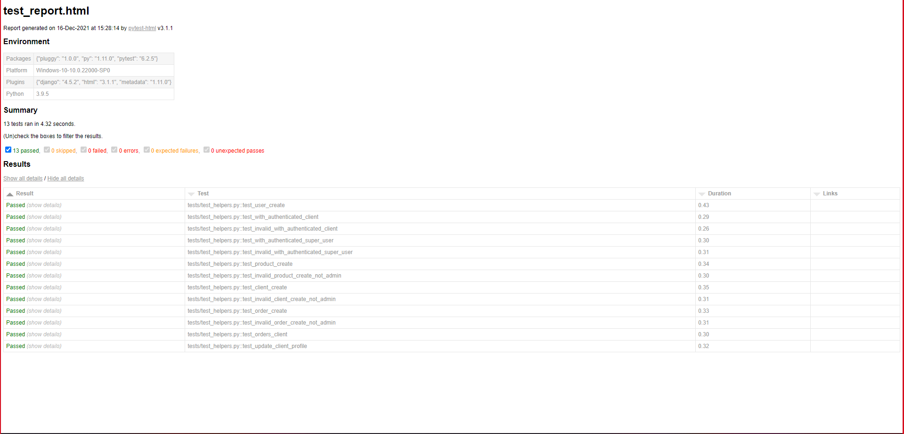

# Mode d'emploi : 
## Définition de l'application :
Le CRM est un outil de gestion d'entreprise (back-office), le notre posséde deux panels :
* Un espace ADMIN (le gérant), qui a accès à tous les historiques de chacun de ses clients, commandes, produits ...etc. avec des options de modification de supression et de mise à jour.
* Un espace CLIENT (unique et personnalisable pour chaque client), il pourra ainsi consulter l'historique de ses commandes avec une possibilité de modifier ses informations personnelles.

## Installation :
Une fois le projet téléchargé, 
```bash
pip install requirements.txt
```
Pour installer tous les packages nécessaires.

Après avoir tout installer, vous pourrez ainsi lancer l'application : 
```commandline
python manage.py runserver
```
Maintenant vous n'avez plus qu'à créer votre compte administrateur, et les autres comptes clients et commencer une démo.

## Les Tests :
Pour ce qui en est des tests, on a utilisé le package [PyTest](https://docs.pytest.org/en/6.2.x/) pour effectuer des tests unitaires automatisés.
Les cas de figures auxquels les tests vont répondre sont : 
* Test de démarrage accès à une base de données de tests et création d'un premier utilisateur.
* Test d'authentification avec un compte CLIENT et redirection vers son espace client.
* Test d'authentification avec compte ADMIN et redirection vers le panel administrateur.
* Test d'accès au panel administratif avec un compte CLIENT, refus et redirection vers le compte client (status_code = 302).
* Test d'accès à un compte d'un client avec des identifiants ADMIN, refus et affichage d'un message d'erreur, "Vous n'avez le droit d'y accéder".
* Test de création de produit une fois authentifié et avec des identifiants ADMIN, TEST OK.
* Test de création de produit une fois authentifié, mais cette fois-ci avec des identifiants CLIENT, refus de création et redirection vers son espace dédié.
* Test de création de client une fois authentifié et avec des identifiants ADMIN, TEST OK.
* Test de création de client une fois authentifié, mais cette fois-ci avec des identifiants CLIENT, refus de création et redirection vers son espace dédié.
* Test de création de commande une fois authentifié et avec des identifiants ADMIN, TEST OK.
* Test de création de commande une fois authentifié, mais cette fois-ci avec des identifiants CLIENT, refus de création et redirection vers son espace dédié.
* Test d'affichage de l'historique de commandes dans un espace client une fois authentifié, TEST OK.
* Test de modification des informations personnelles depuis son compte client après authentification, TEST OK.

# Rapport de tests en image :

